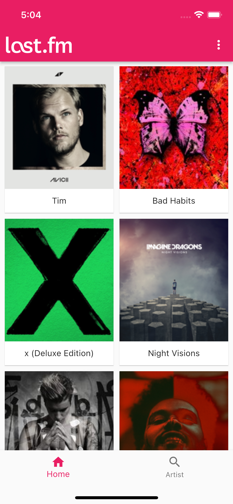
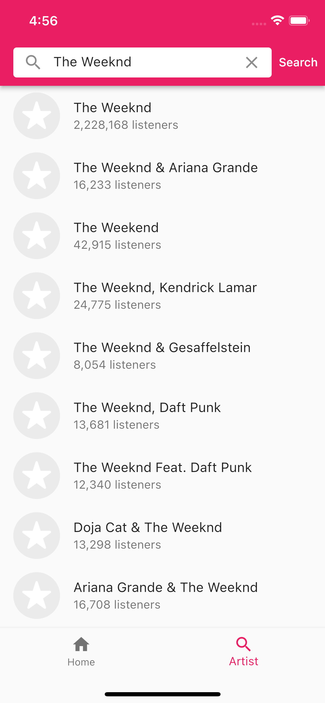
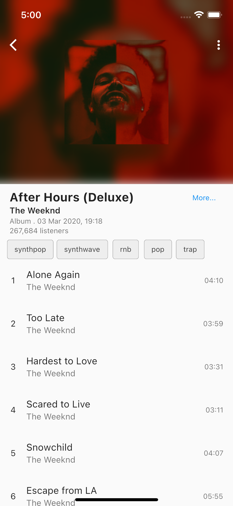

# last_fm

[![codecov][coverage_link]](https://codecov.io/gh/Elias8/last_fm)

A simple app to demonstrate a testable, maintainable, and scalable architecture for flutter. flutter_bloc, hive, and
REST API are some of the tech stacks used in this project.

---

## ScreenShots 📷
             |   
---------------------------------------------|--------------------------------------------------
     |      


## Getting Started

For the app to work, you need to provide your own [last.fm][lastfm_link] API key by issuing [here][lastfm_auth_link].

Once you get your API key, you can run or build the app by using the following command:

```shell
# Run
$ flutter run --dart-define=API_KEY=PUT_YOUR_API_KEY_HERE

# Build
$ flutter build --dart-define=API_KEY=PUT_YOUR_API_KEY_HERE
```

---

## Running Tests

To run all unit and widget tests use the following command:

```shell
$ flutter test --coverage --test-randomize-ordering-seed random
```

To remove generated files from the coverage report, use the following command:

```shell
# install remove_from_coverage package 
$ pub global activate remove_from_coverage

# remove `.g.dart` and `.config.dart` files from the coverage report
$ pub global run remove_from_coverage:remove_from_coverage -f coverage/lcov.info -r '.g.dart', '.config.dart'
```

To view the generated coverage report you can use [lcov][lcov_link].

```shell
# Generate Coverage Report
$ genhtml coverage/lcov.info -o coverage/

# Open Coverage Report
$ open coverage/index.html
```

---

## Working with Translations

This project relies on [flutter_localizations][flutter_localizations_link] and follows
the [official internationalization guide for Flutter][internationalization_link].

### Adding Strings

1. To add a new localized string, open the `app_en.arb` file at `lib/config/l10n/arb/app_en.arb`.

```arb
{
  "@@locale": "en",
  "appName": "LastFM",
  "@appName": {
    "description": "The application name"
  }
}
```

2. Then add a new key/value and description

```arb
{
  "@@locale": "en",
  "appName": "LastFM",
  "@appName": {
    "description": "The application name"
  },
  "albums": "Albums",
  "@albums": {
    "description": "Text shown in the AppBar of AlbumsScreen"
  },
}
```

3. Use the new string

```dart
import 'package:some_app/l10n/l10n.dart';

@override
Widget build(BuildContext context) {
  final l10n = context.l10n;
  return Text(l10n.albums);
}
```

### Adding Supported Locales

Update the `CFBundleLocalizations` array in the `Info.plist` at `ios/Runner/Info.plist` to include the new locale.

```xml
    ...

<key>CFBundleLocalizations</key>
<array>
<string>en</string>
<string>am</string>
</array>

        ...
```

### Adding Translations

1. For each supported locale, add a new ARB file in `lib/config/l10n/arb`.

```
├── l10n
│   ├── arb
│   │   ├── app_en.arb
│   │   └── app_am.arb
```

2. Add the translated strings to each `.arb` file:

`app_en.arb`

```arb
{
  "@@locale": "en",
  "appName": "LastFM",
  "@appName": {
    "description": "The application name"
  },
}
```

`app_am.arb`

```arb
{
  "@@locale": "am",
  "appName": "የመጨረሻ ኤፍ ኤም",
  "@appName": {
    "description": "የመተግበሪያ ስም"
  },
}
```

[flutter_localizations_link]: https://api.flutter.dev/flutter/flutter_localizations/flutter_localizations-library.html

[internationalization_link]: https://flutter.dev/docs/development/accessibility-and-localization/internationalization

[coverage_link]: https://codecov.io/gh/Elias8/last_fm/branch/main/graph/badge.svg?token=H09CZDS7P0


[lastfm_link]: https://www.last.fm

[lastfm_auth_link]: https://www.last.fm/api/authentication

[lcov_link]: https://github.com/linux-test-project/lcov
